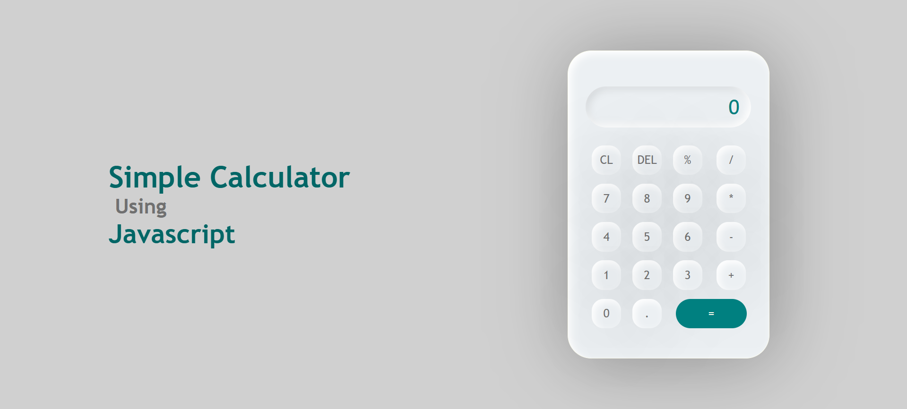

# 🧮 JavaScript Calculator
A fully functional calculator built using **HTML**, **CSS**, and **vanilla JavaScript**.  
This project mimics a real-world calculator with basic arithmetic operations and a responsive design.

## Features

- Performs addition, subtraction, multiplication, and division
- Clear and Delete functionality
- Fully responsive design (mobile & desktop)
- Clean, modern UI with intuitive layout

## Tech Stack

- **HTML5** – structure and layout
- **CSS3** – styling and responsiveness
- **JavaScript** – logic and interactivity

## Preview

### Done in 2023
